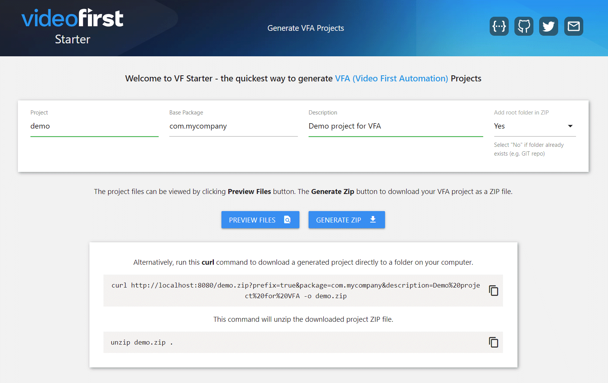

# [VF Starter](https://start.videofirst.io) &middot; [](https://github.com/videofirst/vf-starter/blob/master/LICENSE) [](https://github.com/videofirst/vf-starter/blob/README.md)

Generates [VFA (Video First Automation)](https://github.com/videofirst/vfa) projects which enables users to start their
automation journey as quickly and easily as possible.

## UI

To get started, visit [start.videofirst.io](https://start.videofirst.io), fill in the parameters, click the
**Generate ZIP** button to generate and download your project.



A preview option is also available to examine the files before downloading.

## API

You can also generate projects in your terminal by using `curl` commands: -

```
$ curl https://starter.vieofirst.io/demo.zip -o demo.zip
$ unzip demo.zip -d demo
$ cd demo
$ ./gradlew run
```

Run `curl https://start.videofirst.io` for more info on how to use the API.

## API Docs

API documentation is available: -

* [Swagger / OpenAPI Doc](https://start.videofirst.io/api-docs)

## Developer Docs

**VF Starter** is a small Java web application and CLI, built using [Micronaut Framework](https://micronaut.io/).  
Developer documentation is available: -

* [docs](/docs)

## License

VFA is published under the Apache License 2.0, see https://www.apache.org/licenses/LICENSE-2.0
for the full licence.

## Contributing

See [CONTRIBUTING](CONTRIBUTING.md)
